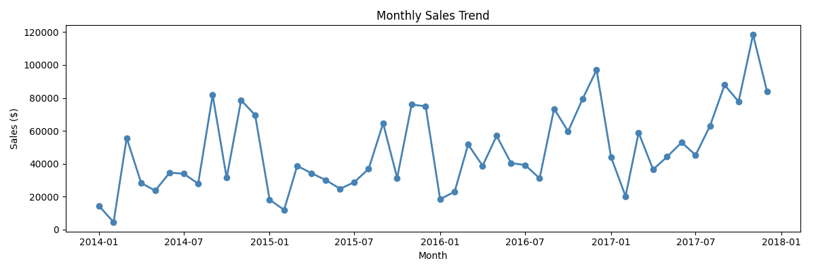
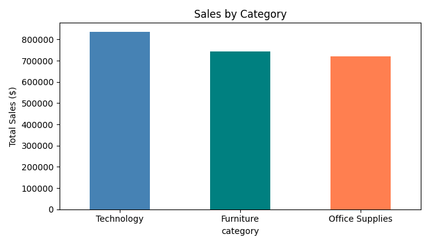
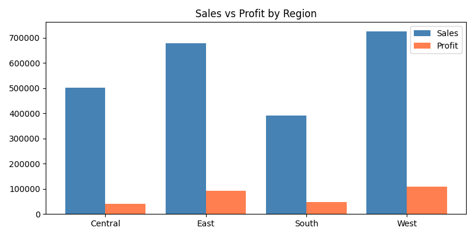
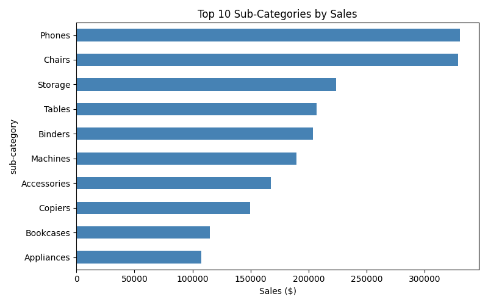
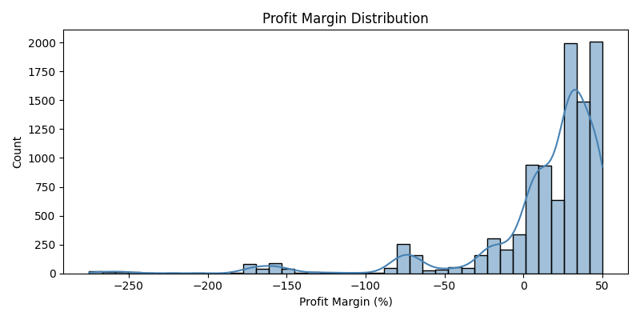

#  Superstore Sales Dashboard

An end-to-end data analysis project analyzing 9,994 retail orders 
from a US Superstore across 4 regions, 3 categories, and 4 years (2014–2018).

---

##  Tools & Technologies
| Tool | Purpose |
|------|---------|
| Python (Pandas, NumPy) | Data cleaning & feature engineering |
| Matplotlib & Seaborn | Data visualization & EDA |
| SQL (SQLite) | Business queries & KPI analysis |
| Power BI | Interactive dashboard |

---

##  Project Structure
```
superstore-sales-dashboard/
│
├── data/
│   ├── superstore.csv           ← Raw dataset
│   └── superstore_clean.csv     ← Cleaned dataset
│
├── charts/
│   ├── chart_monthly_sales.png
│   ├── chart_category_sales.png
│   ├── chart_subcategory.png
│   ├── chart_region.png
│   └── chart_profit_margin.png
│
├── 01_data_cleaning.py          ← Phase 1: Data cleaning
├── 02_eda.py                    ← Phase 2: EDA & charts
├── 03_sql_analysis.py           ← Phase 3: SQL analysis
└── README.md
```

---

##  Dataset
- **Source:** Superstore Sales Dataset (Kaggle)
- **Records:** 9,994 orders
- **Columns:** 21 (raw) → 26 (after feature engineering)
- **Period:** January 2014 – December 2018
- **Regions:** West, East, Central, South

---

## 🔍 Project Workflow

### Phase 1 — Data Cleaning (`01_data_cleaning.py`)
- Fixed column names (lowercase, underscores)
- Converted date columns to datetime format
- Handled missing values and removed duplicates
- Removed invalid records (sales ≤ 0)
- Engineered 5 new features:
  - `profit_margin` — profit as % of sales
  - `order_month`, `order_year`, `order_month_name`
  - `shipping_days` — days between order and ship date

### Phase 2 — EDA & Visualizations (`02_eda.py`)
- Monthly Sales Trend (2014–2018)
- Sales by Category (Technology, Furniture, Office Supplies)
- Top 10 Sub-Categories by Sales
- Regional Sales vs Profit comparison
- Profit Margin Distribution

### Phase 3 — SQL Analysis (`03_sql_analysis.py`)
- Total KPIs (Sales, Profit, Orders, Avg Margin)
- Sales & Profit by Category
- Monthly Revenue Trend
- Top 5 Products by Sales
- Regional Performance with Profit Margin

---

##  Key Business Insights

### 1.  Sales Growing Year-Over-Year
Sales grew consistently from 2014 to 2018, with November being 
the peak month every year — likely driven by holiday shopping.

### 2.  West Region is the Top Performer
| Region | Sales | Profit | Avg Margin |
|--------|-------|--------|------------|
| West | $725,457 | $108,418 | 21.95% |
| East | $678,781 | $91,522 | 16.72% |
| Central | $501,239 | $39,706 | **-10.41%** |
| South | $391,721 | $46,749 | 16.35% |

### 3.  Central Region is Losing Money
Central region has a **negative average profit margin of -10.41%** — 
the business is selling at a loss in this region. This is a critical 
area for business intervention.

### 4.  Top & Bottom Products
| Product | Sales | Profit | Status |
|---------|-------|--------|--------|
| Canon imageCLASS 2200 Copier | $61,599 | $25,199 | ✅ High profit |
| Cisco TelePresence EX90 | $22,638 | -$1,811 | ❌ Loss-making |
| HON 5400 Task Chairs | $21,870 | $0 | ⚠️ Zero profit |

### 5.  Technology Leads in Sales
Technology category drives the highest revenue, followed by 
Furniture and Office Supplies.

---

##  Charts

### Monthly Sales Trend


### Sales by Category


### Regional Performance


### Top Sub-Categories


### Profit Margin Distribution


---

##  How to Run

1. Clone the repository
```bash
git clone https://github.com/Thejasbt19/Sales-Data-Analysis
cd superstore-sales-dashboard
```

2. Install dependencies
```bash
pip install pandas numpy matplotlib seaborn
```

3. Run in order
```bash
python 01_data_cleaning.py
python 02_eda.py
python 03_sql_analysis.py
```

---

## Author
**Thejas BT**  
BCA Final Year Student | Aspiring Data Analyst  
📧 tejutejas980@gmail.com  
🔗 LinkedIn : (www.linkedin.com/in/thejas-bt-6280b2375)

---

##  Skills Demonstrated
`Python` `Pandas` `NumPy` `Matplotlib` `Seaborn` `SQL` `SQLite` `Power BI` `Data Cleaning` `EDA` `Business Analysis`
